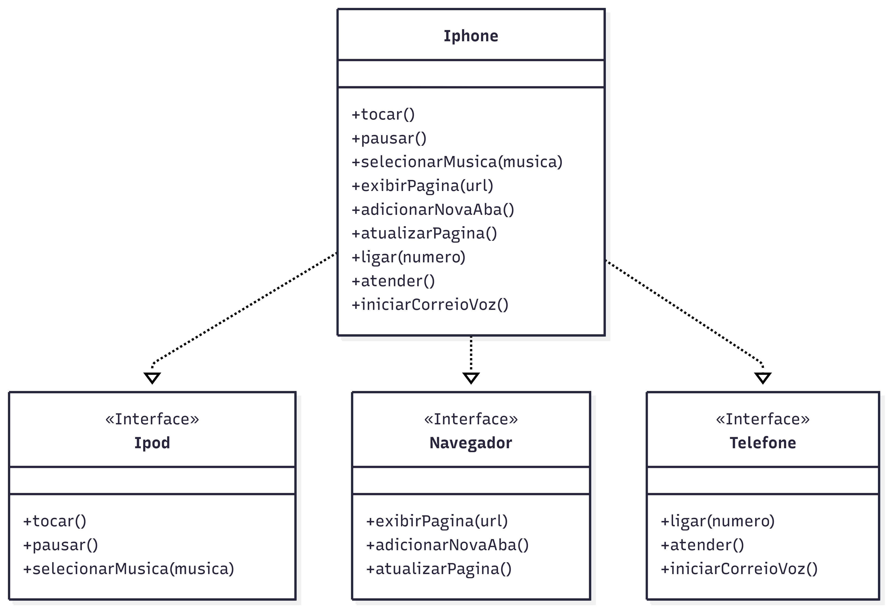

# 📱 Modelagem e Diagramação de um Componente iPhone (POO - DIO)

Este projeto foi desenvolvido como parte do desafio de Programação Orientada a Objetos da **formação Java Developer** da plataforma [DIO](https://www.dio.me/).

## 🎯 Objetivo do Desafio

Modelar e implementar em Java um componente que represente o iPhone. O componente deve incluir as funcionalidades principais:

- 🎵 Reprodutor Musical
- ☎️ Aparelho Telefônico
- 🌐 Navegador na Internet

---

## 📐 Diagrama UML

O projeto inclui um diagrama de classes UML que representa:

- Três interfaces:
  - `Ipod` (reprodutor musical)
  - `Telefone` (aparelho telefônico)
  - `Navegador` (navegador de internet)
- Uma classe `Iphone` que implementa todas as interfaces

---

## 💻 Funcionalidades implementadas

Cada funcionalidade possui seus próprios métodos, conforme abaixo:

### 🎵 Reprodutor Musical (`Ipod`)
- `tocar()`
- `pausar()`
- `selecionarMusica(String musica)`

### ☎️ Aparelho Telefônico (`Telefone`)
- `ligar(String numero)`
- `atender()`
- `iniciarCorreioVoz()`

### 🌐 Navegador de Internet (`Navegador`)
- `exibirPagina(String url)`
- `adicionarNovaAba()`
- `atualizarPagina()`

---

## 🚀 Execução

A classe principal (`Main`) contém um menu interativo que permite ao usuário escolher entre as funcionalidades e testá-las diretamente pelo terminal.